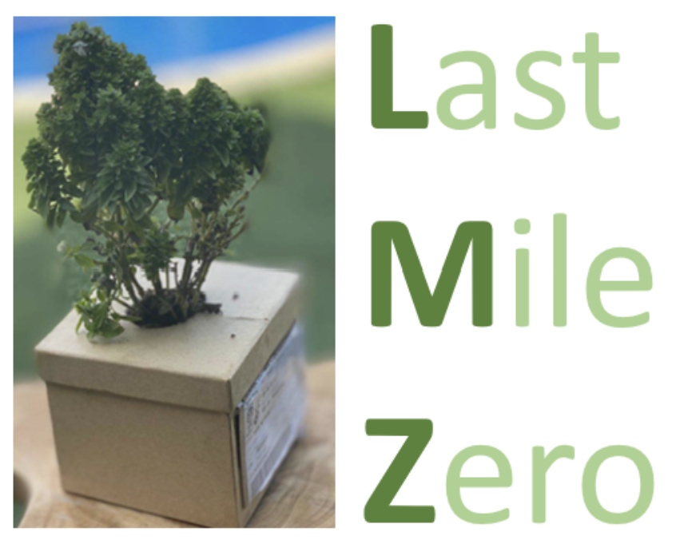

# Proyecto Last Mile Zero (Impact Project)

El proyecto **Last Mile Zero** tiene como objetivo transformar la última milla del comercio electrónico en una experiencia de "entregas cercanas, sencillas y sostenibles".

## Descripción

La última milla en el comercio electrónico es un componente crítico que influye en la satisfacción del cliente y en la eficiencia operativa de las empresas. **Last Mile Zero** se enfoca en abordar los desafíos asociados con esta etapa crucial, buscando soluciones innovadoras que permitan entregas más cercanas al cliente, simplificadas en su proceso y sostenibles desde el punto de vista ambiental.

## Objetivos

- Proporcionar soluciones tecnológicas para optimizar la logística de la última milla.
- Reducir los tiempos de entrega y aumentar la satisfacción del cliente.
- Implementar prácticas sostenibles que minimicen el impacto ambiental de las entregas.
- Facilitar la colaboración entre empresas de comercio electrónico, transportistas y consumidores.

## Funcionalidades

- Seguimiento en tiempo real de los envíos.
- Opciones de entrega flexibles y personalizadas.
- Integración con sistemas de navegación para rutas optimizadas.
- Utilización de vehículos eléctricos y estrategias de empaquetado sostenible.
- Plataforma de retroalimentación para mejorar continuamente el servicio.

## Contribución

¡Estamos abiertos a colaboraciones! Si estás interesado en contribuir al proyecto **Last Mile Zero**, no dudes en ponerte en contacto con nosotros.

## Equipo

- **Beatriz Laborel**
- **Miguel Roig** 
- **[Juanjo Rodríguez](https://github.com/jjrr-es)**
- **Agustí Castro**
- **Jorge Mazuelas**

## Licencia

Este proyecto está bajo la [Licencia MIT](LICENSE).

## Contacto

Puedes contactarnos a través de nuestro correo electrónico [info@lastmilezero.com](mailto:lastmilezero@gmail.com) para obtener más información sobre el proyecto. ¡Esperamos saber de ti!

---

*Última actualización: Febrero de 2024*

